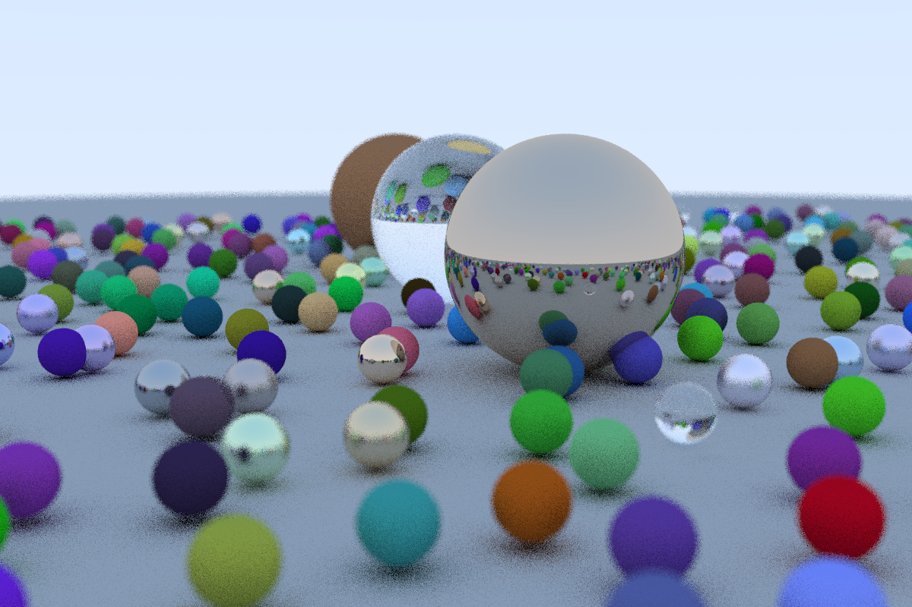

# RaytracingPractise

一个根据 [book: Ray Tracing in One Weekend](https://github.com/RayTracing/raytracing.github.io) 的小练习
[image文件夹](./image/)是过程中生成的一些图片，最终生成的图片如下


# 使用

将ppm文件转为png格式需要用到[imagemagick](https://imagemagick.org/script/download.php)

(Windows)编译项目后，在PowerShell中运行build文件夹下的 [Image_Generater.ps1](./build/Image_Generater.ps1)文件

```
./Image_Generater.ps1
```

即在当前目录可生成图片

# 加速

- ## 多线程

    用了OpenMP来进行多线程加速。由于Visual Studio的默认的MVSC环境不支持OpenMP 3.0以上的版本。所以在Windows系统需要用跨平台的编译器(例如该项目使用的是Clang)

- ## cuda

    因为代码默认执行用的单核CPU，导致生成速度巨慢，可以使用CUDA加速生成，参考了Roger Allen在NVIDIA的[这篇博客](https://developer.nvidia.com/blog/accelerated-ray-tracing-cuda/)
